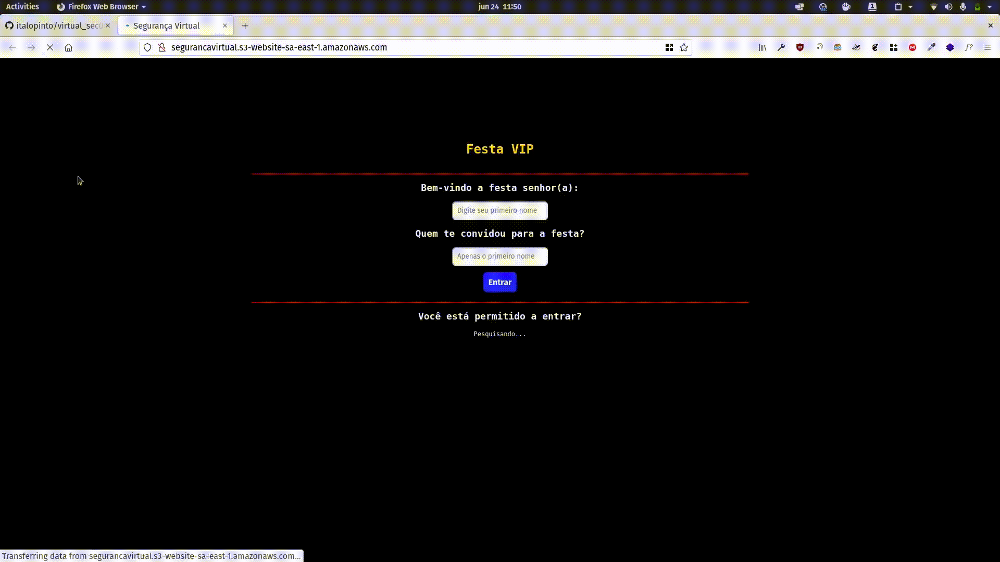

# Virtual security guard

## Project
This is the final project of JavaScript from the YouTube Channel [Dev aprender](https://www.youtube.com/watch?v=i6Oi-YtXnAU).

## Features
- A static website hosted on Amazon S3 for static websites. You can check it out [here](http://segurancavirtual.s3-website-sa-east-1.amazonaws.com/).
- A simple DOM manipulation with JS.
- A CSS file.
- And a favicon made in inkscape.
- 
## Goal
The goal of the project is to validate if a guest is in the list of a host. If yes they can entry otherwise no.